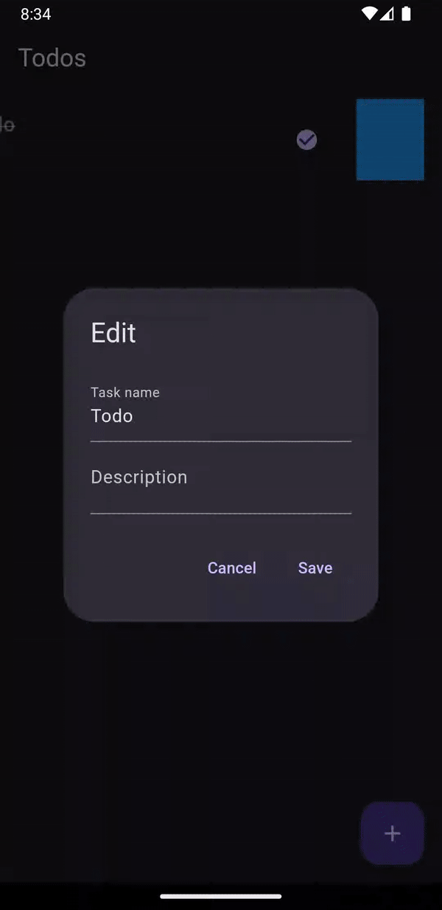

# Todo app

A minimalistic todo list app with sensible defaults.


## Demo


## Run Locally

Clone the project

```bash
  git clone https://link-to-project
```

Go to the project directory

```bash
  cd my-project
```

Check your flutter configuration

```bash
  flutter doctor
```

Install dependencies

```bash
  flutter pub get
```

Run (or use your IDE of choice)

```bash
  flutter run
```

## Tech Stack

- **State management**: flutter_bloc
- **Data layer**: floor, sqflite, get_it
- **Internationalization**: flutter_localizations, intl
- **Design system**: Material 3
- **Utils**: equatable, flutter_hooks

## Helpful resources used in process of development

[Clean Architecture with Flutter](https://www.youtube.com/live/WvGHJef7O-g?feature=share)
[Flutter Clean Architecture - Learn By A Project | Full Beginner's Tutorial](https://www.youtube.com/watch?v=7V_P6dovixg)
[Configure Flutter development environment on Manjaro/Arch linux.](https://dev.to/awais/configure-flutter-development-environment-on-manjaro-arch-linux-4a0a)
[Building a Design system using atomic design methodology in Flutter](https://medium.com/bancolombia-tech/building-a-design-system-using-atomic-design-methodology-in-flutter-327142bf30c2)
[New and easy internationalization in Flutter](https://www.youtube.com/watch?v=tI7u5yeW0VY)
[Flutter Tutorial - Create Dismissible ListView](https://www.youtube.com/watch?v=bblJC7nkkTM)
[cmdline-tools component is missing Error in Flutter](https://www.fluttercampus.com/guide/202/cmdline-tools-component-is-missing-error-flutter/)
[How to Move bottom-sheet along with keyboard which has textfield(autofocused is true)?](https://stackoverflow.com/questions/53869078/how-to-move-bottomsheet-along-with-keyboard-which-has-textfieldautofocused-is-t)
[Create adaptive icons in Flutter with flutter_launcher_icons](https://blog.logrocket.com/create-adaptive-icons-flutter-launcher-icons/)
[Flutter Tutorial - How To Publish Flutter App On Play Store 2023 Build, Release & Deploy App](https://www.youtube.com/watch?v=g0GNuoCOtaQ)


## Authors

- [@GrzywN](https://www.github.com/GrzywN)
